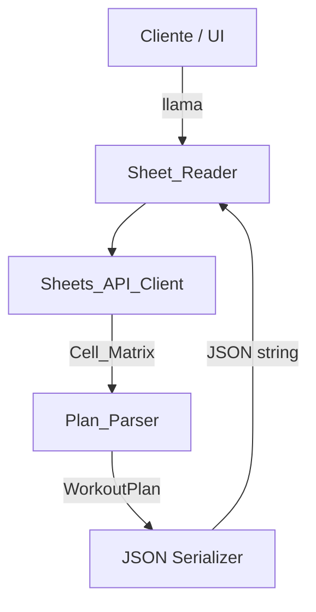

# Design Document: direct-sheet-reader

## Overview

El `Sheet_Reader` es un componente standalone que lee la planilla de rutinas de gimnasio desde Google Sheets API v4 usando el spreadsheet ID y produce un JSON estructurado compatible con el formato de `getPlanStructure()` en `ApiPoc.gs`.

El diseño replica la lógica de parsing ya validada en Apps Script, pero en un entorno externo (Node.js), eliminando la dependencia de Google Apps Script como intermediario. Esto permite que cualquier cliente web o mobile consuma los datos directamente.

### Decisiones de diseño clave

- **Lenguaje: TypeScript/Node.js** — El Google APIs Node.js client es el camino oficial para Sheets API v4. TypeScript agrega seguridad de tipos sobre los modelos de datos.
- **Composite_Values se preservan como strings** — No se intenta parsear `"8 x L"` o `"12.5KxL"` a números. La UI es responsable de la presentación.
- **Compatibilidad con ApiPoc.gs** — Los nombres de campos, estructura de `weekGroups` y `days`, y semántica de columnas 1-based son idénticos al Apps Script existente.
- **Spreadsheet ID de referencia**: `1yS82jhnPtaauYiTwSUf6xoJA_SOR0zU2HMe0f79z1pk`

---

## Architecture



### Flujo de datos

1. El cliente invoca `Sheet_Reader` con el spreadsheet ID, nombre de hoja y credenciales.
2. `Sheet_Reader` delega la lectura a `Sheets_API_Client`.
3. `Sheets_API_Client` produce una `Cell_Matrix`: `string[][]` donde cada celda es un string (vacío si la celda está vacía).
4. `Plan_Parser` recibe la `Cell_Matrix` y ejecuta el algoritmo de detección en dos pasadas:
   - Pasada 1: detectar `Week_Groups` (primeras 20 filas).
   - Pasada 2: detectar `Day_Blocks` y `Exercise_Rows` (todas las filas).
5. El resultado se serializa a JSON y se retorna.

---

## Components and Interfaces

### Sheets_API_Client

```typescript
interface SheetsApiOptions {
  spreadsheetId: string;
  sheetName: string;
  auth: ApiKeyAuth | OAuthCredentials;
}

interface ApiKeyAuth { apiKey: string }
interface OAuthCredentials { keyFile: string; scopes: string[] }

function fetchSheet(options: SheetsApiOptions): Promise<Result<CellMatrix, SheetReaderError>>
```

- Usa `@googleapis/sheets`: `npm install @googleapis/sheets`
- Endpoint: `spreadsheets.values.get` con `range = sheetName` y `valueRenderOption = "FORMATTED_VALUE"`.
- La respuesta `values` es `string[][]`; filas cortas se rellenan con `""` hasta el ancho máximo.
- Scope requerido: `https://www.googleapis.com/auth/spreadsheets.readonly`.

### Plan_Parser

```typescript
function parsePlan(matrix: CellMatrix, sheetName: string, spreadsheetId?: string): Result<WorkoutPlan, SheetReaderError>

// Internals
function detectWeekGroups(matrix: CellMatrix): WeekGroup[]
function detectFieldsForWeek(matrix: CellMatrix, weekRow: number, weekCol: number): WeekFields
function parseDaysAndExercises(matrix: CellMatrix, weekGroups: WeekGroup[]): DayBlock[]
function tryParseExerciseRow(row: string[], rowIndex: number, weekGroups: WeekGroup[]): ExerciseRow | null
```

### Sheet_Reader (punto de entrada)

```typescript
interface SheetReaderConfig {
  source: { type: "sheets-api"; spreadsheetId: string; sheetName: string; auth: ApiKeyAuth | OAuthCredentials }
}

function readSheet(config: SheetReaderConfig): Promise<Result<WorkoutPlan, SheetReaderError>>
function readSheetToJson(config: SheetReaderConfig): Promise<Result<string, SheetReaderError>>
```

### Tipo Result

```typescript
type Result<T, E> = { ok: true; data: T } | { ok: false; error: E }
```

Evita excepciones no controladas; el caller decide cómo manejar errores.

---

## Data Models

### CellMatrix

```typescript
type CellMatrix = string[][]
// Invariante: todas las filas tienen la misma longitud (padding con "")
```

### WeekGroup

```typescript
interface WeekGroup {
  weekLabel: string;      // ej: "SEMANA 1"
  headerRow: number;      // 1-based, fila donde aparece la etiqueta
  startColumn: number;    // 1-based, columna de la etiqueta
  fields: WeekFields;
}

interface WeekFields {
  series?: number;  // columna 1-based, puede ser compartida entre semanas
  reps?: number;
  carga?: number;
  rpe?: number;
}
```

### DayBlock

```typescript
interface DayBlock {
  name: string;        // ej: "DÍA 1"
  subtitle?: string;   // ej: "• FULLBODY"
  row: number;         // 1-based
  exercises: ExerciseRow[];
}
```

### ExerciseRow

```typescript
interface ExerciseRow {
  row: number;       // 1-based
  code: string;      // ej: "B1"
  name: string;      // ej: "Press banca"
  videoUrl?: string; // URL del hipervínculo si existe
  weeks: WeekValues[];
}

interface WeekValues {
  weekLabel: string;
  values: {
    series: string;   // Composite_Value preservado como string
    reps: string;
    carga: string;
    rpe: string;
  };
  columns: {
    series: number | null;
    reps: number | null;
    carga: number | null;
    rpe: number | null;
  };
}
```

### WorkoutPlan (salida final)

```typescript
interface WorkoutPlan {
  spreadsheetId: string;
  spreadsheetName?: string;
  sheetName: string;
  weekGroups: WeekGroup[];
  days: DayBlock[];
}
```

### SheetReaderError

```typescript
interface SheetReaderError {
  code: "SHEET_NOT_FOUND" | "AUTH_ERROR" | "SPREADSHEET_NOT_FOUND"
       | "NO_WEEK_GROUPS" | "UNMAPPABLE_STRUCTURE" | "UNKNOWN";
  message: string;
  details?: unknown;
}
```

---

## Parsing Algorithm

### Pasada 1: Detección de Week_Groups

```
PARA cada fila r en [0, min(20, rows)):
  PARA cada columna c en [0, maxCols):
    cell = normalize(matrix[r][c])
    SI cell coincide con /^semana\s*\d+/ o /^sem\s*\d+/:
      fields = detectFieldsForWeek(matrix, r, c)
      agregar { weekLabel, headerRow: r+1, startColumn: c+1, fields }

deduplicar por (normalize(weekLabel) + "|" + startColumn)
ordenar por startColumn ASC

SI no hay grupos → retornar error NO_WEEK_GROUPS
```

**Detección de campos por semana:**

```
PARA r en [weekRow, weekRow+3]:
  PARA c en [weekCol, weekCol+8):
    cell = normalize(matrix[r][c])
    SI cell contiene "series" → fields.series = c+1
    SI cell contiene "reps"   → fields.reps = c+1
    SI cell contiene "carga"  → fields.carga = c+1
    SI cell == "rpe"          → fields.rpe = c+1
```

**Caso especial — Series compartida (Req 3.5):**  
Si `fields.series` de la primera semana está a la izquierda de `startColumn` de esa semana, se propaga ese mismo valor de columna a todos los `WeekGroup.fields.series`.

### Pasada 2: Detección de Day_Blocks y Exercise_Rows

```
currentDay = null

PARA cada fila r en [0, rows):
  row = matrix[r]

  SI isDayRow(row):
    currentDay = { name: extractDayName(row), row: r+1, exercises: [] }
    SI fila r+1 no es ejercicio ni día → currentDay.subtitle = matrix[r+1][col_nombre]
    agregar currentDay a days
    CONTINUAR

  SI currentDay == null: CONTINUAR

  exercise = tryParseExerciseRow(row, r, weekGroups)
  SI exercise != null: currentDay.exercises.push(exercise)
```

**tryParseExerciseRow:**

```
codeCol = primera columna donde /^[A-Z]\d{1,2}$/i
SI codeCol == -1 → retornar null

nameCol = primera columna en [codeCol+1, codeCol+4) donde looksLikeExerciseName()
SI nameCol == -1 → retornar null

// Video URL: columna entre codeCol y nameCol
videoUrl = hipervínculo en columna codeCol+1 si nameCol > codeCol+1

weeks = PARA cada weekGroup:
  { weekLabel, values: { series, reps, carga, rpe }, columns: { ... } }
  // todos los valores leídos como string desde la columna 1-based del campo

retornar { row: r+1, code, name, videoUrl?, weeks }
```

### Normalización

```typescript
function normalize(value: string): string {
  return value.trim().toLowerCase();
}

function looksLikeExerciseCode(value: string): boolean {
  return /^[A-Z]\d{1,2}$/i.test(value.trim());
}

function looksLikeExerciseName(value: string): boolean {
  const v = value.trim();
  if (v.length < 3) return false;
  if (isWeekLabel(v)) return false;
  if (/^d[ií]a\s*\d+/i.test(v)) return false;
  if (/^(series|reps|carga|rpe)$/i.test(v)) return false;
  return true;
}
```

---

## JSON Output Format

Compatible con `getPlanStructure()` de `ApiPoc.gs`:

```json
{
  "spreadsheetId": "1yS82jhnPtaauYiTwSUf6xoJA_SOR0zU2HMe0f79z1pk",
  "spreadsheetName": "Planificación - Germás Stark",
  "sheetName": "1° Plan",
  "weekGroups": [
    {
      "weekLabel": "SEMANA 1",
      "headerRow": 12,
      "startColumn": 5,
      "fields": {
        "series": 4,
        "reps": 5,
        "carga": 6,
        "rpe": 7
      }
    }
  ],
  "days": [
    {
      "name": "DÍA 1",
      "subtitle": "• FULLBODY",
      "row": 15,
      "exercises": [
        {
          "row": 17,
          "code": "A1",
          "name": "Press banca",
          "videoUrl": "https://...",
          "weeks": [
            {
              "weekLabel": "SEMANA 1",
              "values": {
                "series": "4",
                "reps": "8 x L",
                "carga": "30°",
                "rpe": ""
              },
              "columns": {
                "series": 4,
                "reps": 5,
                "carga": 6,
                "rpe": 7
              }
            }
          ]
        }
      ]
    }
  ]
}
```

---

## Correctness Properties

*A property is a characteristic or behavior that should hold true across all valid executions of a system — essentially, a formal statement about what the system should do. Properties serve as the bridge between human-readable specifications and machine-verifiable correctness guarantees.*

### Property 1: Detección completa de Week_Groups

*For any* Cell_Matrix que contenga etiquetas de semana (que coincidan con `/^semana\s*\d+/i` o `/^sem\s*\d+/i`) en las primeras 20 filas, el `Plan_Parser` debe detectar exactamente todas esas etiquetas y para cada una identificar correctamente las columnas de campos (series, reps, carga, rpe) buscando en las filas y columnas adyacentes.

**Validates: Requirements 3.1, 3.2**

### Property 2: Deduplicación de Week_Groups

*For any* Cell_Matrix donde la misma etiqueta de semana aparece múltiples veces en la misma columna, el `Plan_Parser` debe producir exactamente un `WeekGroup` por combinación única de (etiqueta normalizada, columna de inicio).

**Validates: Requirements 3.4**

### Property 3: Estructura de Day_Blocks y Exercise_Rows

*For any* Cell_Matrix con N filas de día (que coincidan con `/^d[ií]a\s*\d+/i`) y M filas de ejercicio distribuidas entre esos días, el `Plan_Parser` debe producir exactamente N `DayBlock`s y cada ejercicio debe aparecer en el `DayBlock` del día más reciente que lo precede en la matriz.

**Validates: Requirements 4.1, 4.5**

### Property 4: Captura de subtítulo de Day_Block

*For any* Day_Block cuya fila inmediatamente siguiente contiene texto que no es un código de ejercicio ni una etiqueta de columna ni un nombre de día, el `Plan_Parser` debe capturar ese texto como `subtitle` del `DayBlock`.

**Validates: Requirements 4.2**

### Property 5: Completitud de campos en Exercise_Row y WeekGroup

*For any* Exercise_Row en el output del `Plan_Parser`, los campos `row` (1-based), `code`, `name` y `weeks` deben estar presentes; y para cada `WeekGroup` detectado, el array `weeks` debe contener una entrada con `weekLabel`, `values` (con `series`, `reps`, `carga`, `rpe` como strings) y `columns` (con los números de columna 1-based o null). Asimismo, cada `WeekGroup` debe tener `weekLabel`, `headerRow`, `startColumn` y `fields` con valores 1-based correctos.

**Validates: Requirements 3.2, 4.7, 4.9, 6.2, 6.3**

### Property 6: Manejo sin errores de filas no estructurales

*For any* Cell_Matrix que contenga filas separadoras, filas vacías, filas de encabezado o cualquier fila que no sea un día ni un ejercicio válido, el `Plan_Parser` debe completar el parsing sin lanzar excepciones y sin incluir esas filas en el output como ejercicios.

**Validates: Requirements 4.3, 7.3**

### Property 7: Round-trip JSON

*For any* Cell_Matrix válida (con al menos un Week_Group y un Day_Block), parsear con `Plan_Parser`, serializar a JSON con `JSON.stringify`, y deserializar con `JSON.parse` debe producir un objeto `WorkoutPlan` estructuralmente equivalente al original (mismos `weekGroups`, `days`, `exercises` y todos sus campos).

**Validates: Requirements 5.1, 5.2, 5.3**

### Property 8: Invariante de forma del output

*For any* `WorkoutPlan` producido por `Sheet_Reader`, el objeto debe tener los campos top-level `spreadsheetId`, `sheetName`, `weekGroups` (array) y `days` (array); y cada elemento de `days` debe tener `name`, `row` y `exercises` (array).

**Validates: Requirements 5.3, 6.1**

---

## Error Handling

| Código de error | Condición | Módulo |
|---|---|---|
| `SHEET_NOT_FOUND` | Nombre de hoja no existe en la API | Sheets_API_Client |
| `AUTH_ERROR` | Credenciales inválidas, expiradas o scope insuficiente | Sheets_API_Client |
| `SPREADSHEET_NOT_FOUND` | Spreadsheet ID no existe o no es accesible | Sheets_API_Client |
| `NO_WEEK_GROUPS` | No se detectó ninguna etiqueta de semana en las primeras 20 filas | Plan_Parser |
| `UNMAPPABLE_STRUCTURE` | Estructura detectada no puede mapearse al formato esperado | Plan_Parser |
| `UNKNOWN` | Error inesperado no clasificado | Cualquiera |

### Principios

- Todos los errores se retornan como `Result<T, SheetReaderError>` — nunca se lanzan excepciones al caller.
- Los errores de `SHEET_NOT_FOUND` deben incluir en `details` la lista de hojas disponibles.
- Los errores de `AUTH_ERROR` no deben incluir credenciales en el mensaje.
- El `Plan_Parser` nunca retorna un JSON parcialmente correcto: o retorna el plan completo o retorna un error.

### Limitaciones conocidas (Req 7)

- Los colores de fondo de las celdas de RPE (verde/amarillo/rojo) **no son accesibles** mediante `spreadsheets.values.get`. Requieren `spreadsheets.get` con `sheets.data.rowData.values.effectiveFormat.backgroundColor`, lo cual está fuera del scope de esta implementación.
- Toda información de formato visual (colores, bordes, íconos renderizados) se ignora sin generar errores.

---

## Testing Strategy

### Enfoque dual: unit tests + property-based tests

Ambos tipos son complementarios y necesarios:

- **Unit tests**: verifican ejemplos concretos, casos de error y puntos de integración.
- **Property tests**: verifican propiedades universales sobre rangos amplios de inputs generados.

### Librería de property-based testing

**TypeScript/Node.js**: [`fast-check`](https://github.com/dubzzz/fast-check) — `npm install --save-dev fast-check`

```typescript
import fc from "fast-check";
```

Cada property test debe ejecutarse con **mínimo 100 iteraciones** (`numRuns: 100`).

### Unit Tests (ejemplos y casos de error)

- `Sheets_API_Client` con mock 401 → `AUTH_ERROR`
- `Sheets_API_Client` con mock 404 → `SPREADSHEET_NOT_FOUND`
- `Sheets_API_Client` con nombre de hoja inexistente → `SHEET_NOT_FOUND` con lista de hojas
- `Plan_Parser` con matriz sin etiquetas de semana → `NO_WEEK_GROUPS`
- `Plan_Parser` con ejercicios antes de cualquier día → ejercicios ignorados (Req 4.6)
- `Plan_Parser` con columna Series compartida → todos los WeekGroups usan la misma columna (Req 3.5)
- `Plan_Parser` con Video_Icon_Cell → `videoUrl` capturado (Req 4.4)
- Compatibilidad con fixture real: output de `Sheet_Reader` vs output conocido de `ApiPoc.gs` (Req 6.1)

### Property Tests

Cada test referencia la propiedad del diseño con el tag:
`// Feature: direct-sheet-reader, Property N: <texto>`

```typescript
// Feature: direct-sheet-reader, Property 1: Detección completa de Week_Groups
// Feature: direct-sheet-reader, Property 2: Deduplicación de Week_Groups
// Feature: direct-sheet-reader, Property 3: Estructura de Day_Blocks y Exercise_Rows
// Feature: direct-sheet-reader, Property 4: Captura de subtítulo de Day_Block
// Feature: direct-sheet-reader, Property 5: Completitud de campos en Exercise_Row y WeekGroup
// Feature: direct-sheet-reader, Property 6: Manejo sin errores de filas no estructurales
// Feature: direct-sheet-reader, Property 7: Round-trip JSON
// Feature: direct-sheet-reader, Property 8: Invariante de forma del output
```

Los generadores de `fast-check` para matrices de planilla deben producir:
- Etiquetas de semana en posiciones aleatorias dentro de las primeras 20 filas.
- Etiquetas de día (`"DÍA N"`) en filas aleatorias posteriores.
- Códigos de ejercicio (`/^[A-Z]\d{1,2}$/`) con nombres y valores compuestos aleatorios.
- Filas separadoras vacías o con contenido arbitrario intercaladas.

### Estructura de archivos de test sugerida

```
src/
  sheets-api-client.ts
  plan-parser.ts
  sheet-reader.ts
  types.ts
tests/
  unit/
    sheets-api-client.test.ts
    plan-parser.test.ts
    sheet-reader.test.ts
  property/
    week-group-detection.property.test.ts
    day-exercise-structure.property.test.ts
    json-roundtrip.property.test.ts
  fixtures/
    sample-matrix.json   // fixture derivado de la planilla real
```
