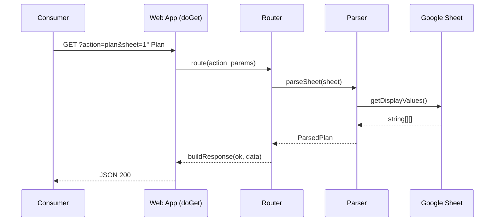
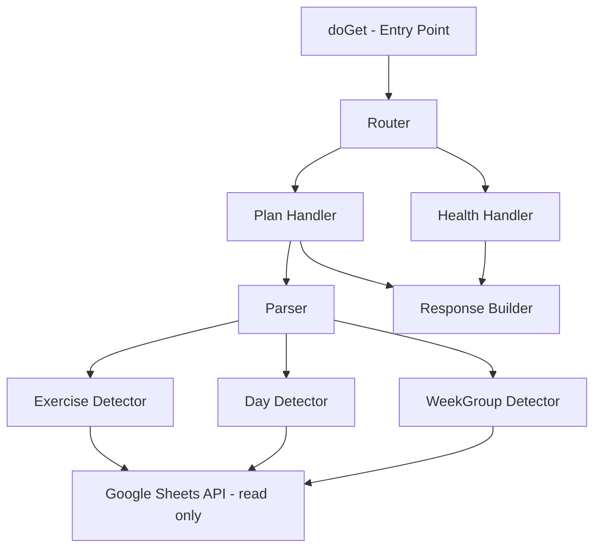

# Design Document: Gym Routine Viewer

## Overview

El Gym Routine Viewer es un Web App de Google Apps Script que expone como JSON la estructura de una Google Sheet de rutinas de gimnasio. El sistema es exclusivamente de lectura y vive como un archivo `.gs` adicional (`ApiPoc.gs`) dentro del proyecto de Apps Script existente, sin tocar ningún script previo.

El flujo es simple: un Consumer hace un `GET` al Web App con un parámetro `action`. El handler despacha a la lógica correspondiente, que lee la Sheet, la parsea y devuelve JSON estructurado.



---

## Architecture

El sistema se organiza en tres capas dentro de `ApiPoc.gs`:



- **Entry Point (`doGet`)**: recibe el request HTTP, extrae parámetros y delega al Router.
- **Router**: despacha según el valor de `action`. Maneja errores de acción desconocida y errores de runtime.
- **Health Handler**: responde con `ok: true` y un mensaje de estado.
- **Plan Handler**: obtiene la Sheet por nombre (default `1° Plan`), invoca al Parser y retorna el resultado.
- **Parser**: recibe el array 2D de valores de la Sheet y produce la estructura `ParsedPlan`.
- **Response Builder**: construye el objeto de respuesta con la forma `{ ok, data }` o `{ ok, error }` y lo serializa como `ContentService` JSON.

Toda la lógica nueva vive en `ApiPoc.gs`. No se importa ni llama ninguna función de `onEdit.gs` u `onOpen.gs`.

---

## Components and Interfaces

### `doGet(e)`

Punto de entrada del Web App. Extrae `e.parameter.action` y `e.parameter.sheet`, envuelve todo en un try/catch global.

```javascript
function doGet(e) { ... }
```

### `routeRequest(action, params)`

Despacha a `handleHealth()` o `handlePlan(params)`. Si `action` no es reconocida, retorna error.

```javascript
function routeRequest(action, params) { ... }
```

### `handleHealth()`

Retorna `{ ok: true, status: "ok" }`.

```javascript
function handleHealth() { ... }
```

### `handlePlan(params)`

Obtiene la Sheet por nombre. Si no existe, retorna error. Si existe, invoca `parseSheet(sheet)` y retorna el resultado.

```javascript
function handlePlan(params) { ... }
```

### `parseSheet(sheet)`

Orquesta la detección de WeekGroups, Days y Exercises. Retorna un objeto `ParsedPlan`.

```javascript
function parseSheet(sheet) { ... }
```

### `detectWeekGroups(values)`

Escanea las primeras 20 filas buscando celdas que coincidan con `/sem(ana)?\s*\d+/i`. Para cada match, construye el `FieldMap` escaneando hasta 4 filas abajo y 8 columnas a la derecha. Deduplica y ordena por `startColumn`.

```javascript
function detectWeekGroups(values) { ... }
```

### `detectDaysAndExercises(values, weekGroups)`

Itera todas las filas. Cuando detecta `/d[ií]a\s*\d+/i`, abre un nuevo Day. Cuando detecta `/^[A-Z]\d{1,2}$/i` en alguna celda, intenta construir un Exercise. Retorna el array de Days con sus Exercises anidados.

```javascript
function detectDaysAndExercises(values, weekGroups) { ... }
```

### `buildResponse(ok, payload)`

Construye el objeto de respuesta y lo serializa con `ContentService.createTextOutput(JSON.stringify(payload, null, 2)).setMimeType(ContentService.MimeType.JSON)`.

```javascript
function buildResponse(ok, payload) { ... }
```

---

## Data Models

### Request Parameters

| Parámetro | Tipo   | Requerido | Default   | Descripción                        |
|-----------|--------|-----------|-----------|------------------------------------|
| `action`  | string | sí        | —         | `"health"` o `"plan"`              |
| `sheet`   | string | no        | `"1° Plan"` | Nombre de la hoja a consultar    |

### SuccessResponse

```typescript
{
  ok: true,
  data: PlanData
}
```

### ErrorResponse

```typescript
{
  ok: false,
  error: string
}
```

### PlanData

```typescript
{
  spreadsheetId: string,
  spreadsheetName: string,
  sheetName: string,
  weekGroups: WeekGroup[],
  days: Day[]
}
```

### WeekGroup

```typescript
{
  weekLabel: string,       // ej: "Semana 1"
  headerRow: number,       // 1-based
  startColumn: number,     // 1-based
  fields: FieldMap
}
```

### FieldMap

```typescript
{
  series: number | null,   // columna 1-based, null si no detectada
  reps:   number | null,
  carga:  number | null,
  rpe:    number | null
}
```

### Day

```typescript
{
  name: string,            // ej: "DÍA 1"
  row: number,             // 1-based
  exercises: Exercise[]
}
```

### Exercise

```typescript
{
  row: number,             // 1-based
  code: string,            // ej: "B1"
  name: string,
  weeks: WeekEntry[]
}
```

### WeekEntry

```typescript
{
  weekLabel: string,
  values: {
    series: string,
    reps:   string,
    carga:  string,
    rpe:    string
  },
  columns: {
    series: number | null,
    reps:   number | null,
    carga:  number | null,
    rpe:    number | null
  }
}
```

---

## Correctness Properties

*A property is a characteristic or behavior that should hold true across all valid executions of a system — essentially, a formal statement about what the system should do. Properties serve as the bridge between human-readable specifications and machine-verifiable correctness guarantees.*

### Property 1: Health response shape

*For any* call to the health handler, the response should have `ok: true` and a non-empty `status` string field.

**Validates: Requirements 1.1**

---

### Property 2: Response envelope invariant

*For any* request (valid or invalid), the response JSON should always contain an `ok` boolean; when `ok` is `true` it should contain a `data` object; when `ok` is `false` it should contain a non-empty `error` string.

**Validates: Requirements 8.1, 8.2, 8.3, 8.4**

---

### Property 3: Plan metadata completeness

*For any* successful plan response, the `data` object should contain `spreadsheetId`, `spreadsheetName`, and `sheetName`, where `sheetName` matches the sheet name that was requested.

**Validates: Requirements 3.1, 3.2, 3.3**

---

### Property 4: Unknown action returns error

*For any* string that is not `"health"` or `"plan"`, passing it as `action` should return `ok: false` with a non-empty `error` string.

**Validates: Requirements 2.4**

---

### Property 5: Missing sheet returns error

*For any* sheet name that does not exist in the Spreadsheet, calling the plan handler should return `ok: false` with a non-empty `error` string.

**Validates: Requirements 2.3**

---

### Property 6: WeekGroup detection completeness

*For any* 2D array of cell values that contains cells matching `Semana N` or `Sem N` (case-insensitive) within the first 20 rows, `detectWeekGroups` should return a WeekGroup for each such cell, each with a non-empty `weekLabel`, a 1-based `headerRow`, and a 1-based `startColumn`.

**Validates: Requirements 4.1, 4.2**

---

### Property 7: WeekGroup FieldMap construction

*For any* 2D array where a week label is followed by field headers (`series`, `reps`, `carga`, `rpe`) within 4 rows below and 8 columns to the right, the resulting WeekGroup's `fields` should map each detected header to its correct 1-based column number.

**Validates: Requirements 4.3**

---

### Property 8: WeekGroup deduplication

*For any* 2D array that contains duplicate week labels at the same `startColumn`, `detectWeekGroups` should return only one WeekGroup per unique `(weekLabel, startColumn)` pair.

**Validates: Requirements 4.4**

---

### Property 9: WeekGroups sorted by startColumn

*For any* 2D array with multiple week labels, the returned `weekGroups` array should be sorted in ascending order by `startColumn`.

**Validates: Requirements 4.5**

---

### Property 10: Day detection completeness

*For any* 2D array that contains rows matching `DÍA N` or `DIA N` (case-insensitive), `detectDaysAndExercises` should return a Day for each such row with the correct `name` and 1-based `row`.

**Validates: Requirements 5.1, 5.2**

---

### Property 11: Exercise grouping under correct Day

*For any* 2D array with multiple Days and Exercises, each Exercise should appear under the Day whose boundary row is the closest preceding day-label row.

**Validates: Requirements 5.3**

---

### Property 12: Exercise detection and shape

*For any* row within a Day that contains a cell matching `[A-Z]\d{1,2}` (case-insensitive) and has a non-empty name in one of the 3 following columns, the parser should include an Exercise with the correct 1-based `row`, `code`, and `name`.

**Validates: Requirements 6.1, 6.2, 6.3**

---

### Property 13: Exercise weeks array completeness

*For any* Exercise parsed from a sheet with N detected WeekGroups, the `weeks` array should have exactly N entries, each with the correct `weekLabel`, `values` (strings read from the FieldMap columns), and `columns` (1-based column numbers or `null` for undefined fields).

**Validates: Requirements 6.5, 6.6, 6.7**

---

## Error Handling

| Scenario | Comportamiento |
|---|---|
| `action` no reconocida | `{ ok: false, error: "Unknown action: <value>" }` |
| `sheet` no existe | `{ ok: false, error: "Sheet not found: <name>" }` |
| Error de runtime inesperado | `{ ok: false, error: e.message }` capturado en el try/catch global de `doGet` |
| ExerciseCode sin nombre adyacente | La fila se omite silenciosamente; no se incluye en el output |
| Campo no encontrado en FieldMap | `values.<field>: ""`, `columns.<field>: null` |
| Sheet sin WeekGroups | `weekGroups: []` |
| Sheet sin Days | `days: []` |

Todos los errores se devuelven con HTTP 200 (limitación de Apps Script `ContentService`) pero con `ok: false` en el cuerpo JSON.

---

## Testing Strategy

### Enfoque dual

Se usan dos tipos de tests complementarios:

- **Unit tests**: verifican ejemplos concretos, casos borde y condiciones de error.
- **Property-based tests**: verifican propiedades universales sobre rangos amplios de inputs generados.

### Unit Tests

Cubren:
- Respuesta exacta del health handler.
- Default de sheet a `"1° Plan"` cuando el parámetro se omite.
- Formato de indentación de 2 espacios en el JSON serializado.
- Casos borde: sheet sin WeekGroups, sheet sin Days, ejercicio sin nombre, campo faltante en FieldMap, error de runtime.

### Property-Based Tests

Se usa **[fast-check](https://github.com/dubzzz/fast-check)** como librería de PBT (compatible con JavaScript/Node.js para testear las funciones puras del parser de forma aislada).

Cada test corre mínimo **100 iteraciones**.

Cada test lleva un comentario de trazabilidad con el formato:
`// Feature: gym-routine-viewer, Property <N>: <texto>`

| Property | Test |
|---|---|
| Property 1 | `fc.assert` sobre `handleHealth()` con cualquier input |
| Property 2 | `fc.assert` sobre `routeRequest(action, params)` con actions arbitrarias |
| Property 3 | `fc.assert` sobre respuesta de plan con sheet válida: `data` contiene los tres campos de metadata |
| Property 4 | `fc.assert` sobre `routeRequest(action, {})` con strings que no sean `"health"` ni `"plan"` |
| Property 5 | `fc.assert` sobre `handlePlan` con nombres de sheet inexistentes |
| Property 6 | `fc.assert` sobre `detectWeekGroups(values)` con arrays sintéticos que contienen etiquetas de semana |
| Property 7 | `fc.assert` sobre `detectWeekGroups(values)` con field headers en posiciones conocidas |
| Property 8 | `fc.assert` sobre `detectWeekGroups(values)` con etiquetas duplicadas |
| Property 9 | `fc.assert` sobre `detectWeekGroups(values)` con múltiples semanas en columnas aleatorias |
| Property 10 | `fc.assert` sobre `detectDaysAndExercises(values, [])` con etiquetas de día en filas aleatorias |
| Property 11 | `fc.assert` sobre `detectDaysAndExercises(values, [])` con múltiples días y ejercicios |
| Property 12 | `fc.assert` sobre `detectDaysAndExercises(values, weekGroups)` con códigos de ejercicio válidos |
| Property 13 | `fc.assert` sobre `detectDaysAndExercises(values, weekGroups)` verificando longitud y forma del array `weeks` |

### Nota sobre el entorno de ejecución

Las funciones del Parser (`detectWeekGroups`, `detectDaysAndExercises`) operan sobre arrays 2D de strings y no dependen de la API de Google Apps Script. Esto permite testearlas en Node.js con fast-check sin necesidad de mocks del entorno de Apps Script.

Los handlers (`handleHealth`, `handlePlan`, `routeRequest`) sí dependen de `SpreadsheetApp`. Para testearlos se usan mocks simples del objeto `SpreadsheetApp`.
